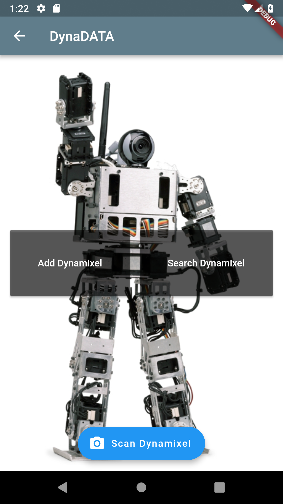
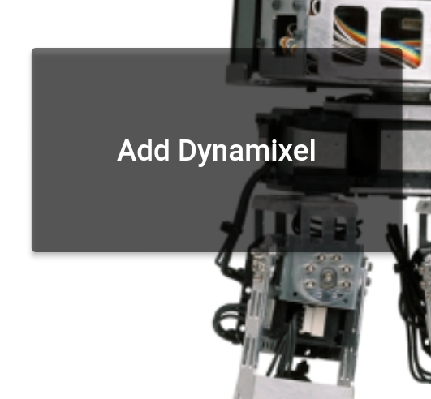
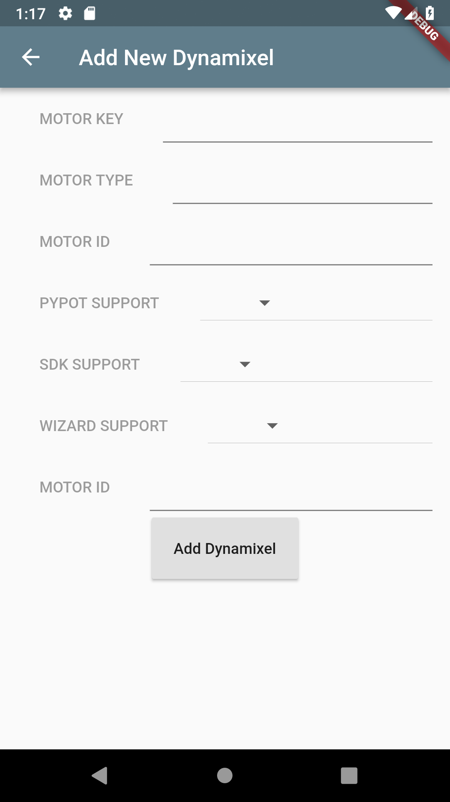
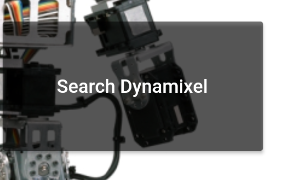
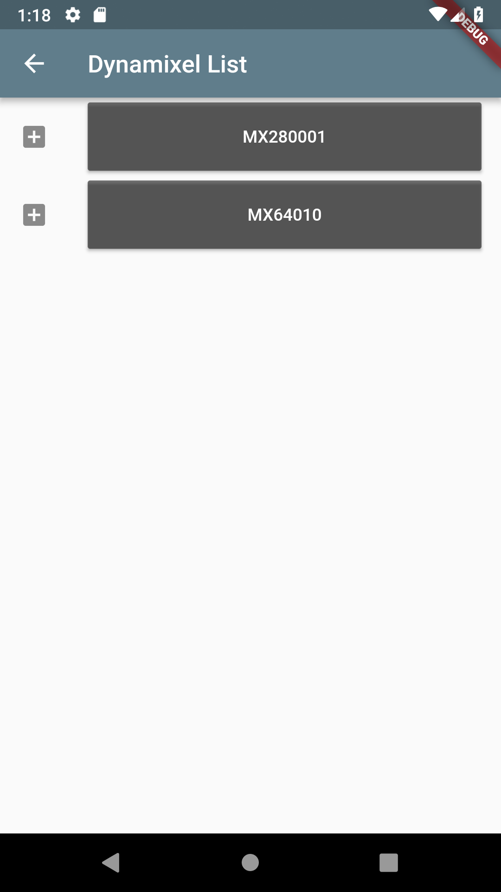
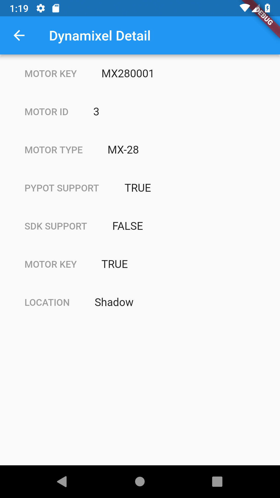
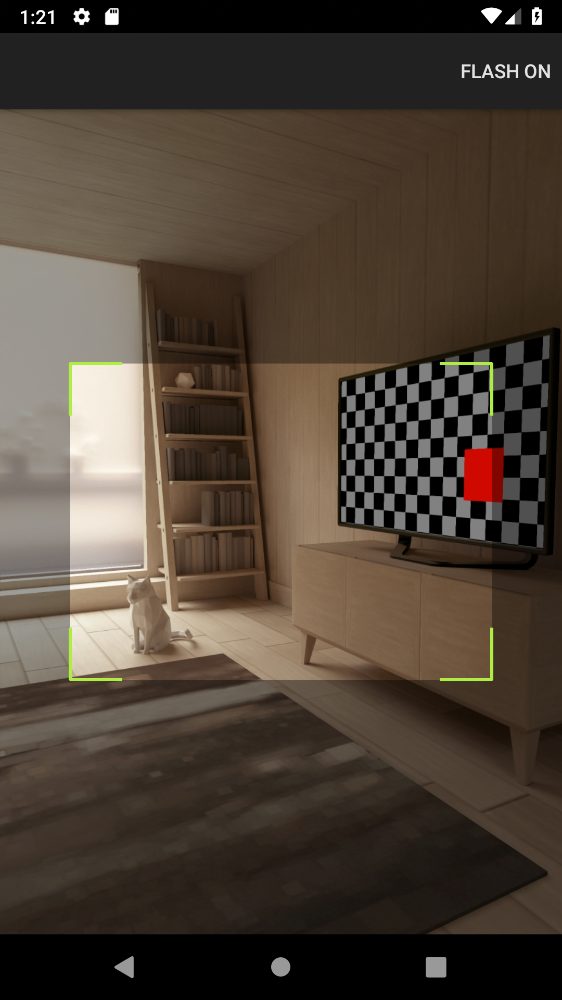

# DynaDATA-flutterapp
A flutter app for acessing and updating the database of dynamixel motors 
=======
# flutter_app

A new Flutter application.
This is what it currently looks like

  
  
  On clicking "Add Dynamixel",we get,
  
  

      
  
  

  
  All the details are stored in Firebase Realtime Database which is shown by clicking on "Search Dynamixel"
  

  
  
  

  
    In which the details are stored.
    
  
  
  as for the qr scanning part 
  

  
  
  

## Pending
  A new widget that generates qr code for each Dynamixel
   and the Dynamixel Detail page is a bit faulty too 
